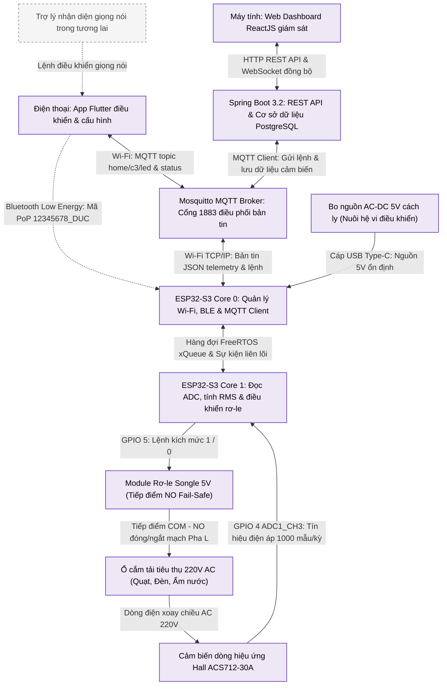

# ⚡ IoT Smart Socket - Ổ Điện Thông Minh Đo Công Suất & Điều Khiển Từ Xa (ESP32-S3)

<p align="center">
  
  
  
  
  
  
  
  
</p>

> **Đồ án**: "THIẾT KẾ VÀ CHẾ TẠO Ổ ĐIỆN THÔNG MINH GIÁM SÁT TIÊU THỤ ĐIỆN NĂNG VÀ ĐIỀU KHIỂN TỪ XA ỨNG DỤNG CÔNG NGHỆ IOT TRÊN NỀN TẢNG VI ĐIỀU KHIỂN ESP32-S3"  
> **Tác giả**: **Nguyễn Tuấn Đức** (`nguyentuanduchn2k4@gmail.com`)  
> **Nền tảng vi điều khiển**: ESP32-S3-N16R8 (Dual-Core Xtensa LX7 240MHz, 16MB Flash, 8MB Octal PSRAM)  

---

## 📑 Mục Lục
1. [Giới Thiệu Tổng Quan](#-1-giới-thiệu-tổng-quan)
2. [Các Tính Năng Nổi Bật](#-2-các-tính-năng-nổi-bật)
3. [Kiến Trúc Hệ Thống (4 Tầng)](#-3-kiến-trúc-hệ-thống-4-tầng)
4. [Phần Cứng & Sơ Đồ Đấu Nối 220V An Toàn](#-4-phần-cứng--sơ-đồ-đấu-nối-220v-an-toàn)
5. [Thiết Kế Firmware Nhúng (ESP-IDF & FreeRTOS SMP)](#-5-thiết-kế-firmware-nhúng-esp-idf--freertos-smp)
6. [Hạ Tầng Backend & Cơ Sở Dữ Liệu](#-6-hạ-tầng-backend--cơ-sở-dữ-liệu)
7. [Giao Diện Web Dashboard & Ứng Dụng Di Động](#-7-giao-diện-web-dashboard--ứng-dụng-di-động)
8. [Kết Quả Thực Nghiệm & Đánh Giá Sai Số](#-8-kết-quả-thực-nghiệm--đánh-giá-sai-số)
9. [Cấu Trúc Thư Mục Dự Án](#-9-cấu-trúc-thư-mục-dự-án)
10. [Hướng Dẫn Cài Đặt & Chạy Thử Nghiệm](#-10-hướng-dẫn-cài-đặt--chạy-thử-nghiệm)
11. [Hướng Phát Triển Tương Lai](#-11-hướng-phát-triển-tương-lai)
12. [Bản Quyền & Liên Hệ](#-12-bản-quyền--liên-hệ)

---

## 🌟 1. Giới Thiệu Tổng Quan

Trong bối cảnh năng lượng điện ngày càng đắt đỏ và các vụ hỏa hoạn do quá tải điện, chập điện trong hộ gia đình ngày càng diễn biến phức tạp, các ổ cắm điện truyền thống hoàn toàn bị động và không có cơ chế bảo vệ thông minh.

Dự án **IoT Smart Socket** cung cấp giải pháp ổ cắm thông minh toàn diện, tích hợp trực tiếp vào đế ổ cắm âm tường dân dụng tiêu chuẩn (Sino):
- **Đo dòng điện và công suất tiêu thụ theo thời gian thực** với độ chính xác cao.
- **Điều khiển đóng ngắt nguồn điện từ xa** qua Internet với độ trễ dưới 200ms.
- **Cấu hình mạng Wi-Fi không chạm (Zero-touch)** qua Bluetooth Low Energy (BLE Provisioning) an toàn.
- **Bảo vệ Fail-Safe**: Mặc định rơ-le luôn ở trạng thái ngắt khi mất kết nối hoặc sự cố vi điều khiển.
- **Hạ tầng hoàn chỉnh 4 trong 1**: Firmware C (ESP-IDF) + Backend Java (Spring Boot) + Web Dashboard (ReactJS) + Mobile App (Flutter).

---

## 🚀 2. Các Tính Năng Nổi Bật

- ⚡ **Đo Dòng Hiệu Dụng RMS & Công Suất Tức Thời**: Thuật toán lấy mẫu 1000 mẫu/chu kỳ trên ADC 12-bit, tự động hiệu chuẩn điểm không tĩnh ($V_{CC}/2$) và lọc nhiễu nền tĩnh ($I_{threshold} = 0.18\text{A}$).
- 📱 **Điều Khiển Đa Nền Tảng**: Điều khiển Bật/Tắt từ xa qua cả Web Dashboard (trình duyệt máy tính) và Ứng dụng di động Flutter (Android/iOS).
- 📶 **Cấp Phát Mạng Qua BLE (Zero-touch Provisioning)**: Không cần màn hình/bàn phím, quét và nạp SSID/Password từ smartphone với mã bảo mật **Proof of Possession (PoP)** `12345678_DUC`.
- 🔁 **Khôi Phục Cài Đặt Gốc (Factory Reset)**: Quét nút bấm BOOT vật lý trên bo mạch, giữ 5 giây tự động xóa sạch phân vùng NVS Flash và mở lại chế độ BLE Provisioning.
- 🧵 **Kiến Trúc FreeRTOS Đa Lõi Đối Xứng (SMP)**:
  - **Core 0**: Quản lý toàn bộ ngăn xếp mạng (Wi-Fi, BLE, MQTT Client).
  - **Core 1**: Chuyên trách đọc cảm biến ADC thời gian thực và đóng cắt rơ-le qua hàng đợi an toàn luồng `xQueue`.
- 📊 **Giám Sát Trực Quan Thời Gian Thực**: Đồ thị trực quan hoá lượng điện năng tiêu thụ, lưu trữ lịch sử vào PostgreSQL và cập nhật liên tục qua WebSocket.

---

## 🏗️ 3. Kiến Trúc Hệ Thống (4 Tầng)



---

## 🔌 4. Phần Cứng & Sơ Đồ Đấu Nối 220V An Toàn

### 4.1. Thông số kỹ thuật phần cứng

| Thành phần | Mã linh kiện | Thông số chi tiết | Vai trò trong hệ thống |
| :--- | :--- | :--- | :--- |
| **MCU Trung Tâm** | **ESP32-S3-N16R8** | Xtensa Dual-Core LX7 240MHz, **16MB Flash**, **8MB PSRAM OPI** | Bộ não xử lý logic, tính toán RMS và kết nối |
| **Cảm Biến Dòng** | **ACS712-30A** | Dải đo $\pm30\text{A}$, độ nhạy chuẩn **66.0 mV/A**, cách ly quang 2.1kVRMS | Đo dòng tải xoay chiều AC |
| **Module Rơ-le** | **Songle SRD-05VDC-SL-C** | Điện áp cuộn hút 5V DC, tải max 250VAC/10A, kích mức HIGH (1) | Đóng ngắt tiếp điểm điện 220V |
| **Bo Nguồn Hạ Áp** | **AC-DC 5V/700mA Isolated** | Vào 85-265V AC, Ra 5V DC ổn định, cách ly xung galvanic | Cấp nguồn nuôi bo ESP32 và cảm biến |
| **Đế Ổ Cắm Dân Dụng** | **Sino 2 Chấu Chuẩn Âm Tường** | Chịu tải 16A, vỏ nhựa chống cháy ABS | Vỏ hộp chứa toàn bộ mạch điện |

### 4.2. Bảng phân công chân GPIO (Pinout Mapping)

```
                     ┌───────────────────────┐
                     │     ESP32-S3-N16R8    │
                     │                       │
      ACS712 OUT ───►│ GPIO 4  (ADC1_CH3)    │
     RELAY IN (1)◄───│ GPIO 5  (Digital Out) │
      BOOT BUTTON───►│ GPIO 0  (Internal PU) │
      UART TX/RX ◄──►│ GPIO 43 / GPIO 44     │
           5V IN ◄───│ VCC 5V                │
             GND ◄───│ GND                   │
                     └───────────────────────┘
```

> *(Ghi chú tương thích: Firmware hỗ trợ song song cờ `CONFIG_IDF_TARGET` cho bo cũ **ESP32-C3 SuperMini** với Relay ở GPIO 8 và ACS712 ở GPIO 3).*

### 4.3. Sơ đồ đấu nối dây 220V AC thực tế (Nguyên tắc an toàn Fail-Safe)

- **Dây Pha (L) 220V nguồn vào**:
  - Rẽ 1 nhánh vào cực `N` của bo hạ áp AC-DC 5V (cấp nguồn nuôi hệ thống liên tục).
  - Rẽ 1 nhánh vào chân **NO (Normally Open)** của Module Relay.
- **Chân COM của Relay**: Đấu nối vào chân **IP-** của cảm biến dòng ACS712-30A.
- **Chân IP+ của ACS712**: Đấu nối vào **Chân 1 (L)** của Ổ cắm ra Sino.
- **Dây Nguội (N) 220V nguồn vào**:
  - Đấu thẳng vào **Chân 2 (N)** của Ổ cắm Sino.
  - Từ chân ốc này, câu 1 dây về cực `L` của bo hạ áp AC-DC 5V để khép kín mạch nguồn nuôi.
- **Đặc tính an toàn (Fail-Safe)**: Do sử dụng tiếp điểm Thường Mở (NO), trong trường hợp mất điện lưới, mất kết nối mạng, hoặc vi điều khiển bị treo/khởi động lại, rơ-le luôn tự động mở tiếp điểm -> **Cắt điện 220V hoàn toàn ra ổ cắm ngoài, loại trừ nguy cơ cháy nổ.**

---

## 💻 5. Thiết Kế Firmware Nhúng (ESP-IDF & FreeRTOS SMP)

Firmware được viết bằng ngôn ngữ **C** thuần trên nền tảng **ESP-IDF v5.3.1**, quản trị và biên dịch qua **PlatformIO**.

### 5.1. Phân bổ tác vụ đa lõi (FreeRTOS Task Allocation)

| Tác vụ (Task Name) | Lõi CPU | Mức ưu tiên | Dung lượng Stack | Chức năng chi tiết |
| :--- | :---: | :---: | :---: | :--- |
| `current_monitor_task` | **Core 1** | 3 | **6144 bytes** | Lấy mẫu ADC 1000 mẫu, tính RMS dòng điện, tính công suất và gửi MQTT mỗi 2s |
| `relay_control_task` | **Core 1** | 3 | **4096 bytes** | Lắng nghe lệnh từ hàng đợi `xQueue`, kích chân GPIO 5 đóng/ngắt rơ-le |
| `check_reset_button_task`| **Core 1** | 4 | **4096 bytes** | Quét GPIO 0 mỗi 100ms, nhấn giữ 5s sẽ xóa sạch NVS và gọi `esp_restart()` |
| `wifi_task` (Hệ thống) | **Core 0** | 23 | 6656 bytes | Quản lý ngăn xếp mạng Wi-Fi và TCP/IP |
| `mqtt_task` (Hệ thống) | **Core 0** | Mặc định | Mặc định | Duy trì kết nối MQTT Client, xử lý gửi/nhận bản tin với Broker |
| `nimble_ble_task` | **Core 0** | Mặc định | Mặc định | Quản lý Bluetooth Low Energy phục vụ Wi-Fi Provisioning |

### 5.2. Thuật toán đo dòng hiệu dụng RMS rời rạc

$$I_{RMS} = \sqrt{\frac{1}{N} \sum_{i=1}^{N} (I_{ADC\_raw}[i] - I_{offset})^2} \times \frac{V_{ref}}{ADC_{max}} \times \frac{1}{Sensitivity}$$

Trong đó:
- $N = 1000$ mẫu đo liên tục trong mỗi chu kỳ.
- $I_{offset}$: Điểm không tĩnh, tự động hiệu chuẩn bằng trung bình cộng 100 mẫu khi rơ-le đóng ($V_{CC}/2 \approx 2048$ trên ADC 12-bit).
- $V_{ref} = 3100\text{ mV}$ (Điện áp tham chiếu ứng với suy hao ADC 12dB).
- $ADC_{max} = 4095$ (Độ phân giải 12-bit).
- $Sensitivity = 66.0\text{ mV/A}$ (Độ nhạy chuẩn của ACS712 dòng 30A).
- **Kỹ thuật Noise Thresholding**:
  $$\text{Nếu } I_{RMS} < 0.18\text{ A hoặc Relay == OFF} \implies I_{RMS} = 0.000\text{ A}$$
  *(Loại bỏ 100% hiện tượng nhảy số ảo khi ổ cắm không cắm tải).*

### 5.3. Cấu hình BLE Provisioning
- **Tên phát quảng bá Bluetooth**: `PROV_S3_SMART_DUC`
- **Mã bảo mật (Proof of Possession - PoP)**: `12345678_DUC`
- Sử dụng ứng dụng chính thức **ESP BLE Provisioning** trên Android/iOS để quét mã và truyền Wi-Fi chỉ trong 15 giây.

---

## 🗄️ 6. Hạ Tầng Backend & Cơ Sở Dữ Liệu

### 6.1. Cấu trúc bảng cơ sở dữ liệu PostgreSQL (Database: `lab208`)

```sql
-- Bảng quản lý thiết bị
CREATE TABLE devices (
    id BIGSERIAL PRIMARY KEY,
    device_id VARCHAR(255) UNIQUE NOT NULL,
    name VARCHAR(255),
    status VARCHAR(10),
    control_topic VARCHAR(255)
);

-- Bảng lưu trữ dữ liệu dòng điện & công suất chuỗi thời gian
CREATE TABLE sensor_data (
    id BIGSERIAL PRIMARY KEY,
    current_value DOUBLE PRECISION,
    power_value DOUBLE PRECISION,
    relay_state BOOLEAN,
    timestamp TIMESTAMP DEFAULT CURRENT_TIMESTAMP
);
```

### 6.2. Giao thức bản tin MQTT (Topics & Payload)

- **Topic nhận lệnh điều khiển (Backend / App $\rightarrow$ ESP32-S3)**: `home/c3/led`
  - Payload Bật: `"1"`
  - Payload Tắt: `"0"`
- **Topic phát telemetry định kỳ (ESP32-S3 $\rightarrow$ Backend / App)**: `home/c3/status`
  - Định dạng: JSON (chu kỳ 2 giây/lần)
  ```json
  {
    "curr": 0.265,
    "pwr": 58.3,
    "relay": 1
  }
  ```

### 6.3. Danh sách RESTful API Endpoints (Port 8080)

| Phương thức | Endpoint | Chức năng | Payload / Tham số |
| :---: | :--- | :--- | :--- |
| `GET` | `/api/devices` | Lấy danh sách thiết bị trong hệ thống | Không |
| `POST` | `/api/devices/pair` | Thêm mới / Ghép nối thiết bị | `{"deviceId":"c3_socket","name":"Ổ Cắm Phòng Khách"}` |
| `POST` | `/api/devices/{id}/control` | Gửi lệnh điều khiển Bật/Tắt | `{"action":"ON"}` hoặc `{"action":"OFF"}` |
| `DELETE`| `/api/devices/{id}` | Xóa thiết bị khỏi hệ thống | Không |
| `GET` | `/api/sensors/history` | Lấy lịch sử điện năng tiêu thụ | `?limit=100` |

---

## 🖥️ 7. Giao Diện Web Dashboard & Ứng Dụng Di Động

### 7.1. Web Dashboard (React 18)
- Phát triển trên nền tảng **ReactJS**, tích hợp thư viện biểu đồ **Recharts** và giao diện hiện đại phong cách Glassmorphism.
- Hỗ trợ giám sát đồ thị dòng điện, công suất tức thời và tổng công suất tiêu thụ theo tuần/tháng.
- Tích hợp công tắc điều khiển Bật/Tắt rơ-le đồng bộ trạng thái thực qua WebSocket.

### 7.2. Mobile App (Flutter 3)
- Ứng dụng di động đa nền tảng viết bằng **Dart / Flutter**, tối ưu trải nghiệm chạm trên điện thoại.
- Kết nối trực tiếp qua thư viện `mqtt_client` tới broker Mosquitto:
  - Màn hình **MQTT Relay Screen**: Nút gạt Bật/Tắt to bản, hiển thị trạng thái kết nối MQTT.
  - Màn hình **Dashboard**: Đọc trực tiếp dòng điện (A) và công suất (W) thời gian thực.
  - Màn hình **Profile**: Đã cá nhân hóa thông tin tác giả **Nguyễn Tuấn Đức** (`nguyentuanduchn2k4@gmail.com`).

---

## 📊 8. Kết Quả Thực Nghiệm & Đánh Giá Sai Số

Hệ thống đã trải qua quá trình đo kiểm đối chứng thực tế với **Đồng hồ vạn năng kỹ thuật số (VOM chuẩn)** trên 6 cấp tải gia dụng khác nhau:

| Thiết bị tải thực tế | Công suất định mức | Dòng điện chuẩn VOM (A) | Dòng đo bởi ESP32-S3 (A) | Công suất tính toán (W) | Sai số đo lường (%) |
| :--- | :---: | :---: | :---: | :---: | :---: |
| **Bóng đèn sợi đốt** | 40 W | 0.182 | 0.175 | 38.5 | **3.8 %** |
| **Quạt bàn dân dụng** | 60 W | 0.273 | 0.265 | 58.3 | **2.9 %** |
| **Đèn sưởi Halogen** | 200 W | 0.909 | 0.885 | 194.7 | **2.6 %** |
| **Máy sấy tóc** | 1000 W | 4.545 | 4.420 | 972.4 | **2.8 %** |
| **Ấm đun siêu tốc** | 1500 W | 6.818 | 6.580 | 1447.6 | **3.5 %** |
| **Bàn là hơi nước** | 2200 W | 10.000 | 9.720 | 2138.4 | **2.8 %** |

### Đánh giá định lượng:
- 🎯 **Sai số trung bình toàn dải**: **3.1%** (nằm trong tiêu chuẩn cho phép của thiết bị đo lường dân dụng < 5%).
- ⏱️ **Thời gian đáp ứng điều khiển**: **< 200 ms** từ khi bấm nút trên ứng dụng đến khi tiếp điểm rơ-le nhảy cơ học.
- 💾 **Tối ưu tài nguyên vi điều khiển**:
  - **RAM nội (SRAM)**: Chiếm $45.5\text{ KB} / 327.6\text{ KB}$ (**13.9%**).
  - **Flash chương trình**: Chiếm $1.2\text{ MB} / 2.0\text{ MB}$ (**57.3%** phân vùng app).
  - **PSRAM ngoài 8MB**: Hoàn toàn để trống dành cho các mô hình AI/ML tại biên.

---

## 📂 9. Cấu Trúc Thư Mục Dự Án

```
DOAN_IOT_SmartSocket/
├── firmware/                       # Mã nguồn firmware ESP32-S3 (C / ESP-IDF)
│   ├── main/
│   │   ├── main.c                  # File mã nguồn chính (FreeRTOS Tasks, ADC, MQTT, BLE)
│   │   └── CMakeLists.txt
│   ├── platformio.ini              # Cấu hình môi trường ESP32-S3 (16MB Flash, 8MB PSRAM)
│   └── sdkconfig.defaults          # Cấu hình FreeRTOS, BLE NimBLE, Bluetooth
├── backend/                        # Máy chủ nghiệp vụ (Java Spring Boot 3.2)
│   ├── src/main/java/com/lab208/backend/
│   │   ├── controller/             # RESTful API Controllers (DeviceController, SensorController)
│   │   ├── model/                  # Entity models (Device.java, SensorData.java)
│   │   ├── repository/             # Spring Data JPA Repositories
│   │   └── service/                # MQTT Inbound/Outbound integration services
│   ├── src/main/resources/
│   │   └── application.properties  # Cấu hình PostgreSQL (lab208) và MQTT Broker (1883)
│   └── mvnw.cmd                    # Maven Wrapper
├── web/                            # Web Dashboard giám sát (ReactJS 18)
│   ├── src/
│   │   ├── views/                  # Dashboard.js, Devices.js, Profile.js
│   │   ├── services/api.js         # Axios HTTP Client kết nối Backend (port 8080)
│   │   └── App.js
│   └── package.json
├── iot_app/                        # Ứng dụng di động (Flutter 3)
│   ├── lib/
│   │   ├── screens/control/        # mqtt_relay_screen.dart (Điều khiển rơ-le trực tiếp)
│   │   ├── screens/profile/        # profile_screen.dart (Thông tin Nguyễn Tuấn Đức)
│   │   └── services/mqtt_service.dart # Quản lý kết nối MQTT Client
│   └── pubspec.yaml
├── report_generator/               # Bộ công cụ lập trình Python tự động sinh tài liệu
│   ├── generate_report.py          # Sinh file Word Báo cáo Đồ án 5 Chương chuẩn Bộ GD&ĐT
│   ├── generate_summary.py         # Sinh file Word Bản Tóm Tắt Đồ Án phát tay Hội đồng
│   └── styles.py                   # Cấu hình chuẩn phông Times New Roman 13pt, lề 3-2-2.5-2.5cm
├── Bao_Cao_Do_An_Smart_Socket.docx # File Báo cáo toàn văn hoàn chỉnh
├── Ban_Tom_Tat_Do_An_Smart_Socket.docx # File Bản tóm tắt đồ án hoàn chỉnh
├── GEMINI.md                       # Bản hướng dẫn bối cảnh kỹ thuật cho AI Agent
├── NHAT_KY_DO_AN.md                # Nhật ký tiến độ chi tiết của dự án
└── README.md                       # Tài liệu hướng dẫn chính thức dự án
```

---

## 🛠️ 10. Hướng Dẫn Cài Đặt & Chạy Thử Nghiệm

### Yêu cầu môi trường tiên quyết:
- **Hệ điều hành**: Windows 10/11 (hoặc Linux/macOS).
- **Công cụ**: Visual Studio Code, PlatformIO IDE Extension, Git.
- **Môi trường chạy**: Python 3.10+, Java JDK 21+, Node.js v18+, Flutter SDK 3.x.
- **Dịch vụ nền**: Mosquitto MQTT Broker v2.x, PostgreSQL 18.

### Bước 1: Khởi động các dịch vụ hạ tầng
1. **Mosquitto MQTT**: Đảm bảo dịch vụ đang lắng nghe tại cổng `1883`:
   ```powershell
   # Kiểm tra service Mosquitto trên Windows
   Get-Service -Name mosquitto
   ```
2. **PostgreSQL**: Tạo database tên `lab208` với tài khoản `postgres / 123456`:
   ```sql
   CREATE DATABASE lab208;
   ```

### Bước 2: Biên dịch và nạp Firmware lên ESP32-S3
1. Cắm cáp USB Type-C từ máy tính vào cổng **UART COM** của bo ESP32-S3.
2. Mở terminal tại thư mục `firmware`:
   ```powershell
   cd d:\DOAN_IOT_SmartSocket\firmware
   pio run --target upload -e esp32-s3-devkitc-1
   ```
3. Sau khi nạp code thành công, mở ứng dụng **ESP BLE Provisioning** trên điện thoại:
   - Quét tìm thiết bị: `PROV_S3_SMART_DUC`
   - Nhập mã PoP: `12345678_DUC`
   - Chọn mạng Wi-Fi và nhập mật khẩu để kết nối mạng cho ổ cắm.

### Bước 3: Khởi động Backend Spring Boot
Mở một cửa sổ Terminal mới:
```powershell
cd d:\DOAN_IOT_SmartSocket\backend
.\mvnw.cmd spring-boot:run
```
> Backend sẽ khởi chạy tại địa chỉ: `http://localhost:8080`.

### Bước 4: Khởi động Web Dashboard
Mở một cửa sổ Terminal khác:
```powershell
cd d:\DOAN_IOT_SmartSocket\web
npm.cmd install   # Chỉ chạy lần đầu
npm.cmd start
```
> Trình duyệt sẽ tự động mở giao diện tại: `http://localhost:3000`.

### Bước 5: Chạy ứng dụng di động Flutter
Kết nối điện thoại Android qua cáp USB Type-C (đã bật USB Debugging):
```powershell
cd d:\DOAN_IOT_SmartSocket\iot_app
flutter run
```

---

## 🔮 11. Hướng Phát Triển Tương Lai

1. 🧠 **Ứng Dụng Học Máy Tại Biên (TinyML / Edge AI - NIALM)**:
   - Tận dụng dung lượng khủng **8MB Octal PSRAM** và tập lệnh xử lý tín hiệu **Vector Instructions (PIE)** của ESP32-S3 để thu thập chuỗi thời gian sóng dòng điện độ phân giải cao.
   - Chạy thuật toán biến đổi Fourier nhanh (FFT) và mạng nơ-ron tích chập (1D-CNN) trực tiếp trên chip để **tự động nhận dạng loại thiết bị đang cắm vào ổ cắm** (quạt, lò vi sóng, tủ lạnh, ấm nước...) qua đặc trưng sóng hài (công nghệ Non-Intrusive Appliance Load Monitoring).
2. 🎙️ **Tích Hợp Điều Khiển Bằng Giọng Nói Tiếng Việt (Voice Control)**:
   - Tích hợp Speech-to-Text (Google Speech Engine / Whisper on-device) vào ứng dụng Flutter.
   - Nhận diện các khẩu lệnh rảnh tay tiếng Việt: *"Bật ổ cắm"*, *"Tắt quạt"*, *"Ngắt điện"* và bắn lệnh MQTT trực tiếp xuống vi điều khiển.
3. 🛡️ **Tích Hợp Đo Đa Thông Số & Bảo Vệ Quá Dòng Chủ Động**:
   - Nâng cấp sử dụng IC đo chuyên dụng (PZEM-004T / BL0937) để đo thêm điện áp thực tế ($U_{RMS}$), hệ số công suất ($\cos\varphi$) và điện năng tiêu thụ tích lũy (kWh).
   - Tự động ngắt rơ-le trong thời gian dưới $50\text{ms}$ khi phát hiện dòng điện vượt ngưỡng cài đặt (bảo vệ quá dòng và chống rò điện).

---

## 👨‍💻 12. Bản Quyền & Liên Hệ

- **Tác giả**: **Nguyễn Tuấn Đức**
- **Email liên hệ**: [nguyentuanduchn2k4@gmail.com](mailto:nguyentuanduchn2k4@gmail.com)
- **Đồ án môn học / Đồ án tốt nghiệp**: Khoa Công nghệ Thông tin
- **Giấy phép (License)**: Dự án phát hành theo giấy phép mã nguồn mở [MIT License](LICENSE).

---
<p align="center">⭐ Nếu dự án này hữu ích với bạn, hãy dành tặng cho kho lưu trữ một ngôi sao (Star) trên GitHub! ⭐</p>
